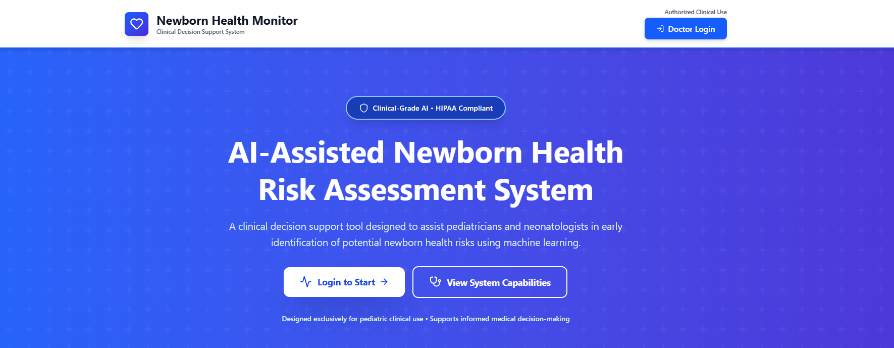

# Newborn Health Monitor — Clinical Decision Support System

Authors: DarkMatterStack 

# neonatal_risk_system

> Newborn Health Monitor is a research‑grade clinical decision support system (CDSS) that combines structured clinical inputs with a modular sequence‑modeling pipeline to produce actionable neonatal risk assessments and clinician‑ready prescriptions. This README is written in a concise, paper‑style format (abstract, methods, experiments, results, conclusions) and is intended to serve both as documentation for developers and as a readable summary for researchers and stakeholders.

  

## 📋 Table of Contents

- [Features](#features)
- [Tech Stack](#tech-stack)
- [Contributing](#contributing)
- [Introduction & motivation](#custom-1767634323470)
- [Our design goals:](#custom-1767634365751)
- [Contact](#custom-1767634529595)
- [System overview (concise)](#custom-1767634629670)

## ℹ️ Project Information

- **👤 Author:** DarkMatterStack
- **📦 Version:** 1.0.0
- **📄 License:** Unlicense
- **🌐 Website:** [https://neonatal-risk-system.vercel.app](https://neonatal-risk-system.vercel.app)
- **📂 Repository:** [https://github.com/anirbandas-01/neonatal_risk_system](https://github.com/anirbandas-01/neonatal_risk_system)

## Features

Core features (MVP)
- Clinician auth (register/login, JWT, role-based access)
- Create/retrieve newborn assessments (form + API)
- Model inference: backend calls model server → risk score + explanation
- Prescription creation and PDF download

Explainability & model
- Parallel encoder streams + attention fusion
- Return attention/feature-importance bundle for visualization
- Heatmap and stream-level bar-chart visualizations

Data & security
- Store records in managed DB (Postgres/Mongo), artifacts in S3
- Secrets manager (no committed .env), TLS, RBAC, audit logs

Dev & MLOps
- Local dev: Docker / docker-compose
- CI: GitHub Actions (lint, tests, build)
- Experiment tracking (MLflow or W&B) and model registry

Monitoring & ops
- Health endpoints, structured logs, Prometheus/Grafana, Sentry
- Model drift monitoring and periodic evaluation

Next immediate steps (recommended)
- Remove/rotate any committed secrets; add .env.example
- Add Docker-compose dev stack and a model stub
- Implement attention extraction + simple viz for clinician UI

Want this turned into a 1‑page task checklist or starter repo scaffold?

## Tech Stack

Frontend: React + TypeScript, Vite, Tailwind CSS, React Query, Chakra UI
Backend API: Node.js + TypeScript, NestJS (or Express + TypeScript), JWT auth, Joi/Zod for validation
ML / Model server: Python 3.10+, FastAPI serving a SavedModel / PyTorch model (or BentoML), pydantic for schemas
Database: PostgreSQL (primary clinical records) + optional MongoDB (semi-structured / logs); use managed cloud DB (RDS / Atlas)
Object storage: S3-compatible (AWS S3, GCP Cloud Storage, MinIO) for artifacts, upload, backups
Model registry / experiments: MLflow or Weights & Biases; artifacts in S3; optionally DVC for data versioning
Containerization & orchestration: Docker + Kubernetes (Helm charts); local dev with docker-compose
Dev tools: Prettier, ESLint, Husky + lint-staged, pytest/pytest-cov, jest + supertest, Dependabot/GitHub Dependabot

## Contributing

------------
- Use issues and pull requests.
- Add tests for model preprocessing and API endpoints.
- For security issues, create a private report and follow responsible disclosure.

## Introduction & motivation

Early identification of newborn health risks improves outcomes through timely intervention. This project combines:
- clinician-captured features (demographics, vitals, labs, sensor signals),
- a modular, interpretable neural architecture that processes distinct feature groups in parallel,
- attention-based fusion to produce clinically meaningful risk scores,
- a lightweight prescription generation module for clinician use.

## Our design goals:

- Interpretability (attention + visualization)
- Reproducibility (pinned environments, Docker)
- Modularity (separate streams; independent retraining)
- Security & privacy (no PHI in repo; secrets must be managed externally)

## Contact

- Name   : ANIRBAN DAS (Full Stack Developer)
- github : anirbandas-01
- Name   : ABHISEK KUNDU (AI/ML Engineer)
- github : abhisekkundu-DS

## System overview (concise)

High-level components:
- Frontend: clinician UI (login, assessment forms, history, download prescription). Screenshot shown above.
- Backend API: Node/Express service that authenticates clinicians, records assessments, requests model inference, generates PDF prescriptions.
- Model service: a containerized inference endpoint (FastAPI/uvicorn or TensorFlow Serving) exposing `/predict` and `/health`.
- Storage: MongoDB for structured records (use managed, RBAC-enabled instance).

Architecture diagram (conceptual)
- Input -> Parallel encoders (per feature group) -> Attention fusion -> Pool -> Classifier head -> Risk score & explanation
- Frontend <---> Backend API <---> Model Server

